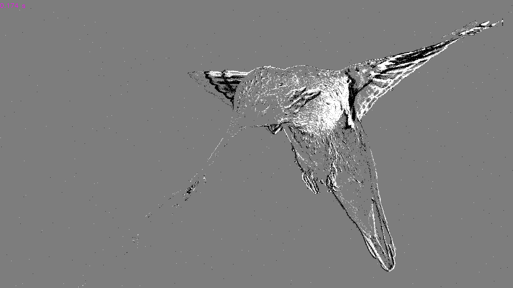
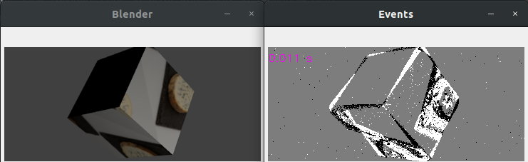
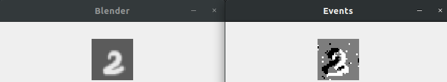
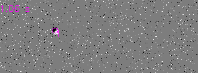

# IEBCS
ICNS Event Based Camera Simulator  

This repository presents the simulator used at ICNS to assess EBC. It contains:
*  cpp: C++17 implementation of the pixel's model and the interface Python-C++. 
* data: Stores distributions used to sample the noise of the sensor and other resources. 
* examples: 4 different ways of using the simulator (see bellow)

This Figure summarizes the differences with others tools, such as 
[ESIM](https://github.com/uzh-rpg/rpg_esim) and 
 [V2E](https://github.com/SensorsINI/v2e):


## Requirements

Tested on Ubuntu 18.04 only.

Create a virtual environment using conda and Python 3.7, and install the packages listed in reqPython.txt

If you wish to use Blender, the following tutorials are using Blender 2.79, which needs to be compiled. 

If you wish to use the C++, run cpp/compile_test.sh to compile, install 
and test the module.

The following links 
[H1](https://wiki.blender.org/wiki/Building_Blender/Linux/Ubuntu)
[H2](https://devtalk.blender.org/t/unable-to-compile-blender-2-8-as-python-module/4641/4)
 will help you to correctly install Blender in your  conda environment.

## Examples

### Video -> events

It shows how to simulate events from a video. To initialize the C++ sensor:
```
dsi.initSimu(cap.get(cv2.CAP_PROP_FRAME_HEIGHT), cap.get(cv2.CAP_PROP_FRAME_WIDTH))
dsi.initLatency(200, 50, 50, 300)
dsi.initContrast(0.3, 0.3, 0.05)
init_bgn_hist_cpp("../../data/noise_pos_161lux.npy", "../../data/noise_pos_161lux.npy")
```
The first line initialize the definition of the sensor, then:  
latency = 200 μs   
jitter = 50 μs  
refractory period = 50 μs  
time constant log front-end = 300 μs
positive log threshold = 0.3  
negative log threshold = 0.3  
threshold mismatch = 0.05  
Then the positive and negative noise is sampled from 2 distributions acquired with a real sensor.



### Blender spinning cube

This example shows how to render a camera rotating in front of a texture cube. In this case, the object is rendered after 
1000 μs. In this case, the cheese textured is a Fourme d'Ambert. 

  

### Blender custom NMNIST

Here the NMNIST dataset is reproduced (for 10 digits, the code for the full dataset can be asked). 
The script "generate_textures_MNIST.py" create the texture used in blender to generate the saccadic movement:
  
And the script "saccades_N_MNIST_ONE.py" generate the images from Blender and runs the simulator. Note that compared to 
the previous example, all the positions of the camera are computed first and then Blender is called to render this
sequence faster. 
  
Finally, the script "nmnist_util.py" provides some API to read the spikdes and the labels if you want to use your favorite
ML framework.

### Tracking dataset

This script generates a tracking dataset with object of various size and contrasts.  
  
Every object has its own spike and groundtruth file.
