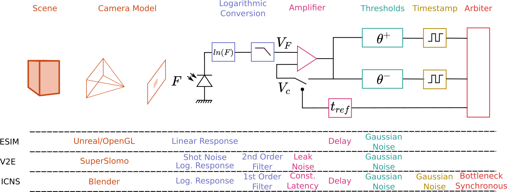
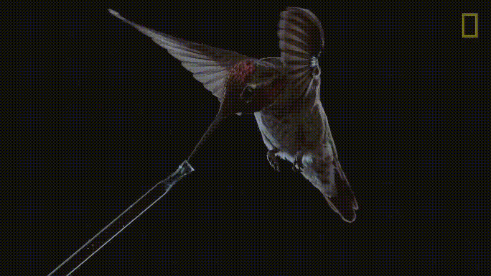
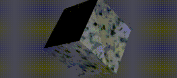
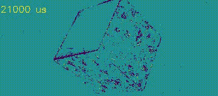
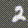
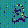
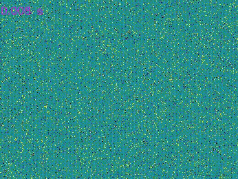

# IEBCS
ICNS Event Based Camera Simulator 

NEW: Available in Matlab.

This repository presents the simulator used at ICNS to assess EBC. It contains:
* /cpp/: C++11 implementation of the pixel simulation model and the interface Python/C++. 
* /matlab/: interface Matlab/C++
* /data/: Stores distributions used to sample the noise of the sensor and other resources. 
* /examples/: Several different ways of using the simulator (see bellow)'*

This Figure summarizes the differences with others tools, such as 
[ESIM](https://github.com/uzh-rpg/rpg_esim) and 
 [V2E](https://github.com/SensorsINI/v2e):



## -- Requirements and Install -- 

Tested on Ubuntu 18.04, Python > 3.7. 

To use the Python interface, create a virtual environment using conda:
```
conda env create -f simuDVSICNS.yml 
conda activate testSimu
```
To use the C++ interface, run compile_test.sh to install and test the Python/C++ interface.

Additionnal requirements: 
* Blender: exemples 01 and 02 are using Blender 2.79, which needs to be compiled and installed. See [H1](https://wiki.blender.org/wiki/Building_Blender/Linux/Ubuntu) [H2](https://devtalk.blender.org/t/unable-to-compile-blender-2-8-as-python-module/4641/4) for further details. 

* C++: run cpp/compile_test.sh to compile, install 
and test the module.

## -- Examples --

### 00: Video -> events

Simulate events from a video. To initialize the C++ sensor:
```
dsi.initSimu(cap.get(cv2.CAP_PROP_FRAME_HEIGHT), cap.get(cv2.CAP_PROP_FRAME_WIDTH))
dsi.initLatency(200, 50, 50, 300)
dsi.initContrast(0.3, 0.3, 0.05)
init_bgn_hist_cpp("../../data/noise_pos_161lux.npy", "../../data/noise_pos_161lux.npy")
```
The first line initialize the definition of the sensor, then:  
* latency = 200 μs   
* jitter = 50 μs  
* refractory period = 50 μs  
* time constant log front-end = 300 μs
* positive/negative log threshold = 0.3  
* threshold mismatch = 0.05  
* The noise is sampled from 2 distributions acquired with a real sensor under 161lux.



The artifacts are due to the low framerate compared to the speed of the wings. This can be compensated using slow motion estimations as done in V2E, provided that the estimation is not adding noise. 

### 01: Blender spinning cube

This example shows how to render a camera rotating in front of a textured cube. In this case, the object is rendered every ms. In this case, the cheese textured is a Fourme d'Ambert (blue chees). 





### 02: Blender custom NMNIST

The NMNIST dataset is simulated (for 10 digits here). 
The script "generate_textures_MNIST.py" create the texture used in blender to generate the saccadic movement: 
And the script "saccades_N_MNIST_ONE.py" generates the images from Blender and runs the simulator. Note that compared to the previous example, all the positions of the camera are computed first and then Blender is called to render this sequence faster. 
Finally, the script "nmnist_util.py" provides some API to read the spikdes and the labels if you want to use your favorite ML framework.




### 03: Tracking dataset

This script generates a tracking dataset with object of various size and contrasts.  
 

Every object has its own spike and groundtruth file.
